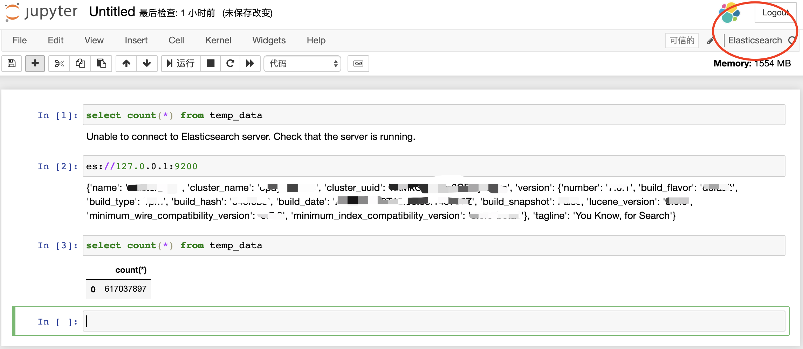

# Elasticsearch_kernel

Elasticsearch  Kernel for Jupyter


[](https://pypi.python.org/pypi/elasticsearch_kernel)


[中文介绍](document/chinese.md)

## Installation

#### step1:
```
pip3 install elasticsearch_kernel
```

To get the newest one from this repo (note that we are in the alpha stage, so there may be frequent updates), type:

```
pip3 install git+git://github.com/Hourout/elasticsearch_kernel.git
```

#### step2:
Add kernel to your jupyter:

```
python3 -m elasticsearch_kernel.install
```

ALL DONE! 🎉🎉🎉

## Uninstall

#### step1:

View and remove elasticsearch kernel
```
jupyter kernelspec list
jupyter kernelspec remove elasticsearch
```

#### step2:
uninstall elasticsearch kernel:

```
pip3 uninstall elasticsearch-kernel
```

ALL DONE! 🎉🎉🎉

## Using

```
jupyter notebook
```


### step1: you should set elasticsearch server (host and port)

### step2: write your elasticsearch sql


## Quote 
kernel logo


- https://www.elastic.co/cn/elasticsearch
